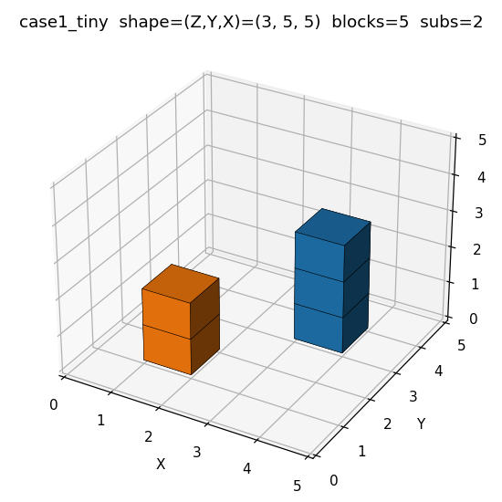
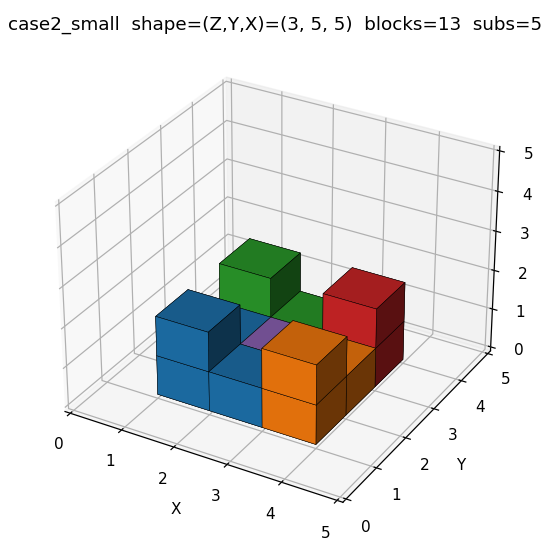
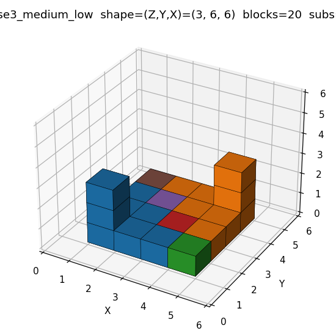
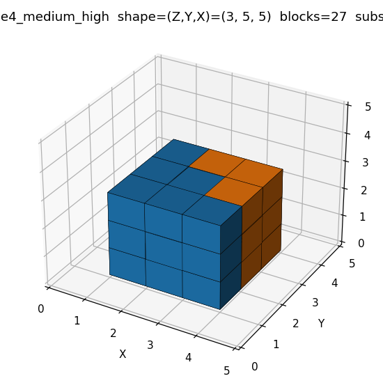
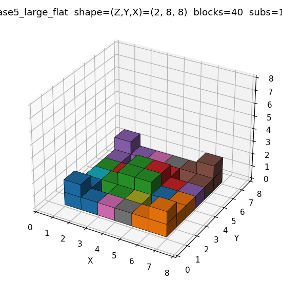
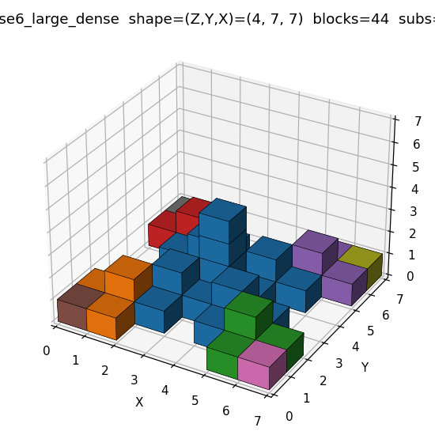

# Benchmark structures for the MILP+CBS hybrid planner

Six hand-designed structures spanning a complexity axis from tiny to large.
The set is **not** a reproduction of any paper's benchmark — the thumbnails
in the reference paper's Table III are too small to derive exact `(Z, Y, X)`
arrays from. These cases are designed to characterize where MILP handles
the load vs where the CBS fallback kicks in.

Definitions live in [`macc_rviz/benchmark_structures.py`](../macc_rviz/benchmark_structures.py).
Each function returns a `numpy.ndarray` shaped `(Z, Y, X)` with `1` for filled
and `0` for empty, satisfying Definition 1 (no floating blocks).

## Decomposition stats

Stats below come from `decompose_structure` + `find_parallel_groups` (the
existing pipeline). Sub block sizes are listed in build order.

| Case | Shape (Z,Y,X) | Blocks | Subs | Parallel groups | Sub block sizes |
|---|---|---:|---:|---:|---|
| `case1_tiny`        | (3, 5, 5) |  5 |  2 | 1 | [3, 2] |
| `case2_small`       | (3, 5, 5) | 13 |  5 | 1 | [4, 3, 3, 2, 1] |
| `case3_medium_low`  | (3, 6, 6) | 20 |  6 | 1 | [8, 8, 1, 1, 1, 1] |
| `case4_medium_high` | (3, 5, 5) | 27 |  2 | 1 | [18, 9] |
| `case5_large_flat`  | (2, 8, 8) | 40 | 18 | 1 | [4, 4, 8, 4, 4, 4, 1, 1, 1, 1, 1, 1, 1, 1, 1, 1, 1, 1] |
| `case6_large_dense` | (4, 7, 7) | 44 |  9 | 1 | [24, 4, 4, 4, 4, 1, 1, 1, 1] |

**Note on parallel groups.** All six cases decompose into a single
parallel group. This is a property of the shadow-based decomposition: the
algorithm assigns every column to a single sub (all of that column's `z`
levels go to the same sub), so the inter-sub dependency check
`np.roll(s2, 1, axis=0) & s1` never fires. Parallelism within the group
is bounded by `num_robots` (4), not by group structure.

## Per-case design notes

### Case 1 — Tiny (5 blocks)



Two well-separated low towers (`h=2` and `h=3`) on a 5×5 grid.
Heightmap:

```
0 0 0 0 0
0 2 0 0 0
0 0 0 0 0
0 0 0 3 0
0 0 0 0 0
```

Smallest possible MILP load — every sub should solve in <1s. Useful as a
sanity check that the hybrid path doesn't overhead-hit trivial cases.

### Case 2 — Small (13 blocks)



A 3×3 base with four corner `h=2` towers and a single `h=1` center cell.
Heightmap:

```
0 0 0 0 0
0 2 1 2 0
0 1 1 1 0
0 2 1 2 0
0 0 0 0 0
```

Decomposes cleanly into 5 small subs (one per corner tower + center
singleton). This is the workhorse "small but multi-sub" case — every sub
should solve via MILP and demonstrate the trip-fusion path.

### Case 3 — Medium low (20 blocks)



Flat 4×4 base with two diagonally-opposite corner towers at `h=3`.
Heightmap:

```
0 0 0 0 0 0
0 3 1 1 1 0
0 1 1 1 1 0
0 1 1 1 1 0
0 1 1 1 3 0
0 0 0 0 0 0
```

Two large-ish subs (8 blocks each, the corner towers absorbing their
shadow regions) plus four single-block leftovers. Tests mixed sub sizes.

### Case 4 — Medium high (27 blocks)



A 3×3×3 solid cube. Heightmap:

```
0 0 0 0 0
0 3 3 3 0
0 3 3 3 0
0 3 3 3 0
0 0 0 0 0
```

Dense, near MILP scale boundary. Decomposes into just 2 subs because the
tallest tower's shadow rad 2 absorbs most of the cube. The 18-block sub
is the primary stress on per-sub MILP.

### Case 5 — Large flat (40 blocks)



Sparse 8×8×2 pattern with 4 corner + 4 inner `h=2` towers and `h=1` fill.
Heightmap:

```
0 0 0 0 0 0 0 0
0 2 1 1 1 1 2 0
0 1 0 1 1 0 1 0
0 1 1 2 2 1 1 0
0 1 1 2 2 1 1 0
0 1 0 1 1 0 1 0
0 2 1 1 1 1 2 0
0 0 0 0 0 0 0 0
```

Many small subs, all parallelizable. Primarily tests trip-fusion and
greedy robot assignment rather than per-sub MILP solver scale.

### Case 6 — Large dense (44 blocks)



Cross-shaped layout with central `h=4` tower, an `h=2` inner ring, and
`h=1` corner satellites. Heightmap:

```
1 1 0 0 0 1 1
1 2 1 0 1 2 1
0 1 2 1 2 1 0
0 0 1 4 1 0 0
0 1 2 1 2 1 0
1 2 1 0 1 2 1
1 1 0 0 0 1 1
```

The 24-block central sub is the expected MILP failure domain at the
configured budgets (`per_t=60s`, `total=600s`, `T_max=150`). This is the
primary fallback validation case.

## Reproducing

```python
from macc_rviz.benchmark_structures import ALL_CASES
for name, fn in ALL_CASES:
    structure = fn()
    print(name, structure.shape, int(structure.sum()))
```
